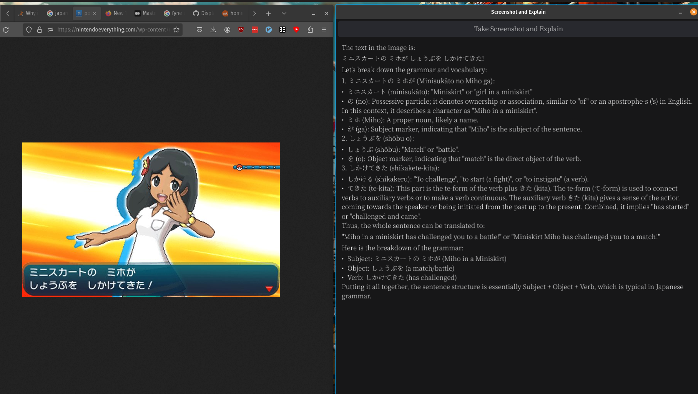
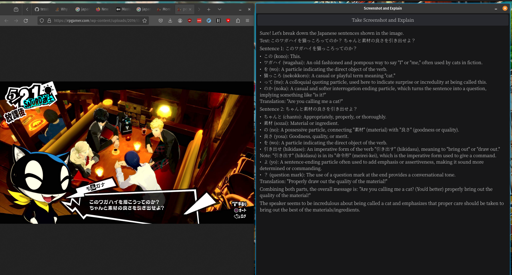
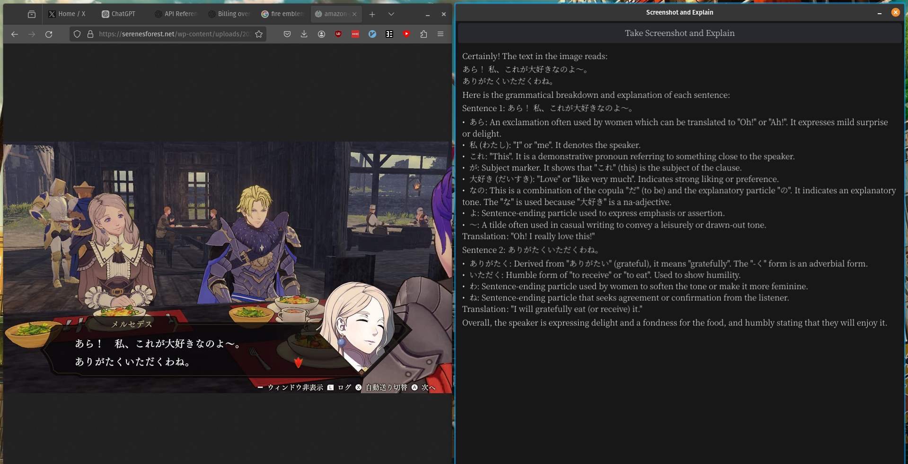

# jp-game-assistant

A small program that helps eplain japanese grammar from a game window using chatGPT. It takes a screenshot of your entire screen, then feeds it to chatGPT asking it to explain the japanese grammar. Most of the time it gets it right!

## setup

1. clone this repo
1. copy `.env_example` as `.env` and add your openAI api key and perferrred model
1. run `go install`
1. run `go run main.go`
1. play your game, and when you encounter some japanese you don't understand, hit the button!
1. ???
1. Profit!

## screenshots

